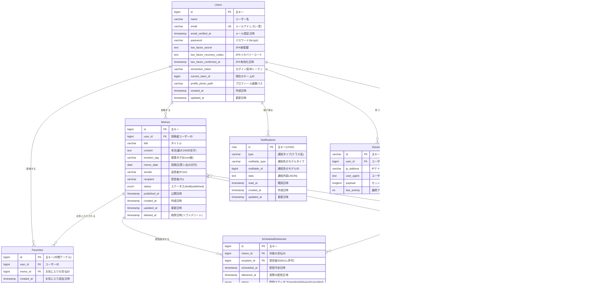
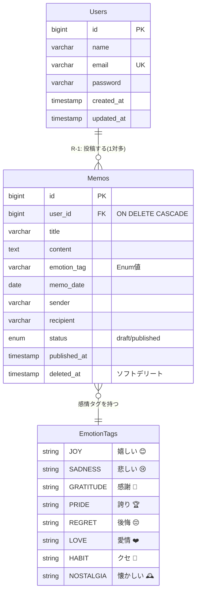
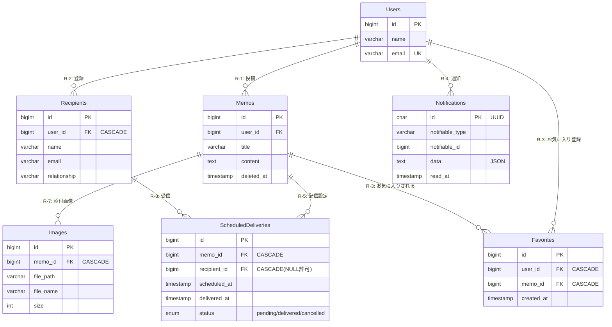
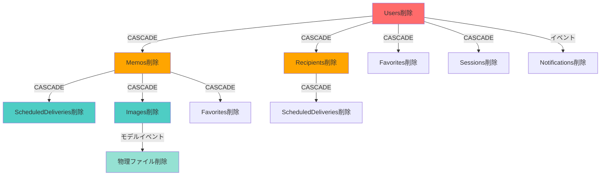

# ER図（エンティティ・リレーションシップ図）

**プロジェクト**: 言伝（ことづて）アプリケーション  
**作成日**: 2024年12月16日  
**最終更新**: 2024年12月16日  
**バージョン**: 1.0

---

## 概要

本ドキュメントは、言伝アプリケーションの完全なER図（Entity-Relationship Diagram）を含みます。
全エンティティとそれらの間のリレーションシップを視覚化しています。

---

## 完全版ER図

---

## フェーズ別ER図

### 🎯 フェーズ1: コアMVP（実装最優先）

### 🚀 フェーズ2: 機能強化（追加実装）

---

## リレーションシップ一覧

| # | 親エンティティ | カーディナリティ | 子エンティティ | リレーション種別 | 削除制約 | 実装フェーズ |
|---|---|---|---|---|---|---|
| **R-1** | Users | 1 → 多 | Memos | 1対多 | CASCADE | フェーズ1 |
| **R-2** | Users | 1 → 多 | Recipients | 1対多 | CASCADE | フェーズ2 |
| **R-3** | Users | 多 ↔ 多 | Memos（お気に入り） | 多対多 | CASCADE | フェーズ2 |
| **R-4** | Users | 1 → 多 | Notifications | Polymorphic | 手動 | フェーズ2 |
| **R-5** | Memos | 1 → 多 | ScheduledDeliveries | 1対多 | CASCADE | フェーズ2 |
| **R-6** | Memos | 多 ↔ 多 | Recipients | 多対多 | CASCADE | フェーズ2 |
| **R-7** | Memos | 1 → 多 | Images | 1対多 | CASCADE | フェーズ2 |
| **R-8** | Recipients | 1 → 多 | ScheduledDeliveries | 1対多 | CASCADE | フェーズ2 |

---

## 削除制約（CASCADE）の関係図

---

## 注意事項

### 多対多リレーションシップの表現

本ER図では、多対多リレーションシップを**中間テーブル経由で明示的に表現**しています：

1. **R-3（お気に入り）**: `Users` ↔ `Memos`
   - 中間テーブル: `Favorites`
   - `Users ||--o{ Favorites` + `Memos ||--o{ Favorites`

2. **R-6（配信スケジュール）**: `Memos` ↔ `Recipients`
   - 中間テーブル: `ScheduledDeliveries`
   - `Memos ||--o{ ScheduledDeliveries` + `Recipients ||--o{ ScheduledDeliveries`

この表現方法により、データベース設計との対応が明確になります。

### NULL許可について

- `ScheduledDeliveries.recipient_id`: NULL許可
  - 受信者未指定の配信スケジュールに対応

---

## 📝 変更履歴

| 日付 | バージョン | 変更内容 | 担当者 |
|------|-----------|---------|--------|
| 2024-12-16 | 1.0 | 初版作成 | AI Assistant |

---

## 📌 関連ドキュメント

- [entities.md](./entities.md) - エンティティ定義
- [relationships.md](./relationships.md) - リレーションシップ詳細設計
- [requirements.md](./requirements.md) - プロジェクト要件定義

---

**文書管理情報**:
- ファイル名: er_diagram.md
- 保存場所: プロジェクトルート
- 最終更新者: AI Assistant
- 次回レビュー: フェーズ1実装完了後

