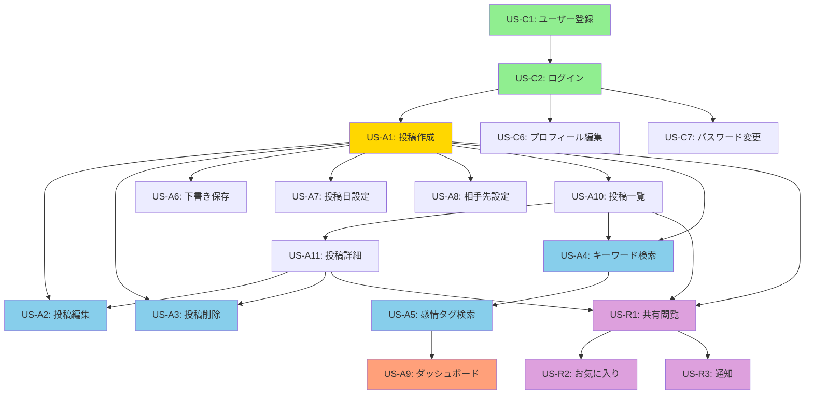

# 言伝アプリ 機能一覧表

**バージョン**: 1.0  
**作成日**: 2024年12月14日  
**最終更新**: 2024年12月14日

---

## 📊 機能サマリー

| 項目 | 数値 |
|------|------|
| **総機能数** | 21 |
| **フェーズ1機能** | 15（38 SP） |
| **フェーズ2機能** | 3（13 SP） |
| **実装済み機能** | 5 |
| **未実装機能** | 13 |

---

## 目次

1. [投稿管理機能](#1-投稿管理機能)
2. [検索・発見機能](#2-検索発見機能)
3. [分析・可視化機能](#3-分析可視化機能)
4. [メタデータ管理機能](#4-メタデータ管理機能)
5. [認証・アカウント管理機能](#5-認証アカウント管理機能)
6. [共有・通知機能](#6-共有通知機能)
7. [依存関係図](#依存関係図)
8. [実装ロードマップ](#実装ロードマップ)
9. [技術要件マトリックス](#技術要件マトリックス)

---

## 1. 投稿管理機能

**カテゴリ説明**: 言伝の作成・編集・削除・閲覧など、コアとなるCRUD操作を提供する機能群

| 機能ID | 機能名 | 機能概要 | カテゴリ | 対象ロール | 優先順位 | SP | フェーズ | 状態 | 依存関係 |
|--------|--------|----------|----------|-----------|----------|----|----|------|---------|
| US-A1 | 言伝の投稿 | タイトル、本文、感情タグを設定して言伝を投稿 | 投稿管理 | 投稿者 | ⭐⭐⭐ Must Have | 5 | 1 | 未実装 | US-C2 |
| US-A2 | 投稿の編集 | 自分の投稿内容を修正・更新 | 投稿管理 | 投稿者 | ⭐⭐⭐ Must Have | 3 | 1 | 未実装 | US-A1, US-A11 |
| US-A3 | 投稿の削除 | 確認ダイアログ付きで投稿をソフトデリート | 投稿管理 | 投稿者 | ⭐⭐⭐ Must Have | 2 | 1 | 未実装 | US-A1, US-A11 |
| US-A6 | 下書き保存 | 投稿を下書きとして保存し、後で公開可能 | 投稿管理 | 投稿者 | ⭐⭐ Should Have | 3 | 1 | 未実装 | US-A1 |
| US-A10 | 投稿一覧の閲覧 | 自分の投稿をカード形式で一覧表示 | 投稿管理 | 投稿者 | ⭐⭐⭐ Must Have | 3 | 1 | 未実装 | US-A1 |
| US-A11 | 投稿詳細の閲覧 | 投稿の全文と詳細情報を表示 | 投稿管理 | 投稿者 | ⭐⭐⭐ Must Have | 2 | 1 | 未実装 | US-A1 |

**カテゴリ合計**: 6機能、18 Story Points

### 主要技術要件
- Livewire Volt（Functional API）
- Flux UI Card/Button/Modal コンポーネント
- Eloquent ORM（`Memo` モデル）
- Policy による認可制御（`MemoPolicy`）
- Form Request バリデーション
- ソフトデリート（`deleted_at`）
- `wire:navigate` によるSPA的遷移

---

## 2. 検索・発見機能

**カテゴリ説明**: キーワード検索や感情タグによるフィルタリングで、過去の投稿を効率的に発見する機能群

| 機能ID | 機能名 | 機能概要 | カテゴリ | 対象ロール | 優先順位 | SP | フェーズ | 状態 | 依存関係 |
|--------|--------|----------|----------|-----------|----------|----|----|------|---------|
| US-A4 | キーワード検索 | タイトル・本文をリアルタイムで部分一致検索 | 検索・発見 | 投稿者 | ⭐⭐⭐ Must Have | 3 | 1 | 未実装 | US-A1, US-A10 |
| US-A5 | 感情タグでの検索 | 8種類の感情タグで投稿を絞り込み | 検索・発見 | 投稿者 | ⭐⭐⭐ Must Have | 3 | 1 | 未実装 | US-A1, US-A4 |

**カテゴリ合計**: 2機能、6 Story Points

### 主要技術要件
- `wire:model.live.debounce.300ms` によるリアルタイム検索
- Eloquent `LIKE` クエリ（`where('title', 'like', "%{$keyword}%")`）
- ページネーション（15件/ページ）
- URL状態保持（クエリパラメータ）
- N+1対策（`with('user')`）
- 複合検索（キーワード + 感情タグ）

---

## 3. 分析・可視化機能

**カテゴリ説明**: 投稿活動の統計情報やダッシュボードを提供し、投稿習慣を可視化する機能群

| 機能ID | 機能名 | 機能概要 | カテゴリ | 対象ロール | 優先順位 | SP | フェーズ | 状態 | 依存関係 |
|--------|--------|----------|----------|-----------|----------|----|----|------|---------|
| US-A9 | ダッシュボード | 投稿数、感情別統計、最近の投稿を表示 | 分析・可視化 | 投稿者 | ⭐⭐ Should Have | 5 | 1 | 未実装 | US-A1, US-A5 |

**カテゴリ合計**: 1機能、5 Story Points

### 主要技術要件
- Eloquent 集計クエリ（`count()`, `groupBy()`）
- Computed プロパティ（`computed` ヘルパー）
- Flux UI Card/Badge コンポーネント
- レスポンシブグリッドレイアウト
- 感情タグ別カウント（8種類）
- 最近の投稿プレビュー（直近5件）

---

## 4. メタデータ管理機能

**カテゴリ説明**: 投稿日や送受信者情報など、投稿に付随するメタデータを管理する機能群

| 機能ID | 機能名 | 機能概要 | カテゴリ | 対象ロール | 優先順位 | SP | フェーズ | 状態 | 依存関係 |
|--------|--------|----------|----------|-----------|----------|----|----|------|---------|
| US-A7 | 投稿日の設定 | 過去・未来の日付を手動設定可能 | メタデータ管理 | 投稿者 | ⭐ Could Have | 2 | 1 | 未実装 | US-A1 |
| US-A8 | 相手先の設定 | 送信者（From）と受信者（To）を設定 | メタデータ管理 | 投稿者 | ⭐ Could Have | 1 | 1 | 未実装 | US-A1 |

**カテゴリ合計**: 2機能、3 Story Points

### 主要技術要件
- HTML5 Date Picker（`<input type="date">`）
- Nullable カラム（`sender`, `recipient`, `memo_date`）
- 日付形式変換（Carbon）
- バリデーション（最大50文字）
- ソート優先順位（`memo_date` → `published_at` → `created_at`）

---

## 5. 認証・アカウント管理機能

**カテゴリ説明**: ユーザー登録、ログイン、セキュリティ設定など、アカウント管理に関する機能群

| 機能ID | 機能名 | 機能概要 | カテゴリ | 対象ロール | 優先順位 | SP | フェーズ | 状態 | 依存関係 |
|--------|--------|----------|----------|-----------|----------|----|----|------|---------|
| US-C1 | ユーザー登録 | メールアドレスとパスワードでアカウント作成 | 認証・アカウント | 共通 | ⭐⭐⭐ Must Have | - | - | ✅ 実装済み | なし |
| US-C2 | ログイン | メールアドレスとパスワードでログイン | 認証・アカウント | 共通 | ⭐⭐⭐ Must Have | - | - | ✅ 実装済み | US-C1 |
| US-C3 | ログアウト | セッションを破棄してログアウト | 認証・アカウント | 共通 | ⭐⭐⭐ Must Have | - | - | ✅ 実装済み | US-C2 |
| US-C4 | パスワードリセット | メール経由でパスワードを再設定 | 認証・アカウント | 共通 | ⭐⭐⭐ Must Have | - | - | ✅ 実装済み | US-C1 |
| US-C5 | 2要素認証の設定 | QRコードとリカバリーコードで2FA有効化 | 認証・アカウント | 共通 | ⭐⭐ Should Have | - | - | ✅ 実装済み | US-C2 |
| US-C6 | プロフィール編集 | 名前とメールアドレスを更新 | 認証・アカウント | 共通 | ⭐⭐ Should Have | 3 | 1 | 未実装 | US-C2 |
| US-C7 | パスワード変更 | 現在のパスワード確認後に新パスワード設定 | 認証・アカウント | 共通 | ⭐⭐ Should Have | 2 | 1 | 未実装 | US-C2 |

**カテゴリ合計**: 7機能、5 Story Points（実装済みを除く）

### 主要技術要件
- Laravel Fortify（認証基盤）
- bcrypt パスワードハッシュ化（cost=12）
- CSRF保護
- セッション管理（2時間有効）
- 2FA（TOTP、リカバリーコード）
- メール送信（パスワードリセット）
- Form Request バリデーション

---

## 6. 共有・通知機能

**カテゴリ説明**: 投稿者から受信者へのメッセージ共有と通知機能（フェーズ2）

| 機能ID | 機能名 | 機能概要 | カテゴリ | 対象ロール | 優先順位 | SP | フェーズ | 状態 | 依存関係 |
|--------|--------|----------|----------|-----------|----------|----|----|------|---------|
| US-R1 | 共有された言伝の閲覧 | 自分宛てに共有されたメッセージを閲覧 | 共有・通知 | 受信者 | ⭐⭐ Should Have | 5 | 2 | 未実装 | US-A1, US-A10, US-A11 |
| US-R2 | お気に入り機能 | 大切なメッセージをお気に入りに追加 | 共有・通知 | 受信者 | ⭐ Could Have | 3 | 2 | 未実装 | US-R1 |
| US-R3 | 新着通知 | メール・アプリ内で新着メッセージを通知 | 共有・通知 | 受信者 | ⭐⭐ Should Have | 5 | 2 | 未実装 | US-R1 |

**カテゴリ合計**: 3機能、13 Story Points

### 主要技術要件
- 中間テーブル（`memo_recipients`）
- 既読/未読管理（`read_at` タイムスタンプ）
- お気に入りフラグ（`is_favorite`）
- Laravel Notifications（メール・データベース通知）
- 通知設定（ON/OFF、頻度）
- 読み取り専用Policy

---

## 依存関係図

### 全体依存関係フロー



**凡例**:
- 🟢 緑: 実装済み（認証系）
- 🟡 金: コア機能（US-A1）
- 🔵 水色: Must Have機能
- 🟠 橙: Should Have機能
- 🟣 紫: フェーズ2機能

### 依存関係テーブル

| 機能ID | 直接依存 | 間接依存 | ブロッカー | 実装可能条件 |
|--------|----------|----------|-----------|-------------|
| US-A1 | US-C2 | US-C1 | なし | ログイン機能のみ |
| US-A2 | US-A1, US-A11 | US-C2, US-A10 | US-A1, US-A11 | 詳細画面が必要 |
| US-A3 | US-A1, US-A11 | US-C2, US-A10 | US-A1, US-A11 | 詳細画面が必要 |
| US-A4 | US-A1, US-A10 | US-C2 | US-A1, US-A10 | 一覧画面が必要 |
| US-A5 | US-A1, US-A4 | US-A10 | US-A4 | 検索UIが必要 |
| US-A6 | US-A1 | US-C2 | US-A1 | 投稿機能のみ |
| US-A7 | US-A1 | US-C2 | US-A1 | 投稿機能のみ |
| US-A8 | US-A1 | US-C2 | US-A1 | 投稿機能のみ |
| US-A9 | US-A1, US-A5 | US-A4, US-A10 | US-A5 | 集計データが必要 |
| US-A10 | US-A1 | US-C2 | US-A1 | 投稿データが必要 |
| US-A11 | US-A1 | US-C2 | US-A1 | 投稿データが必要 |
| US-C6 | US-C2 | US-C1 | US-C2 | ログイン機能のみ |
| US-C7 | US-C2 | US-C1 | US-C2 | ログイン機能のみ |
| US-R1 | US-A1, US-A10, US-A11 | US-C2 | US-A11 | 投稿システム完成 |
| US-R2 | US-R1 | US-A1, US-A10, US-A11 | US-R1 | 共有機能が必要 |
| US-R3 | US-R1 | US-A1, US-A10, US-A11 | US-R1 | 共有機能が必要 |

---

## 実装ロードマップ

### フェーズ1: コアMVP（2-3ヶ月、38 Story Points）

#### スプリント1（Week 1-2）: 基本投稿機能
**目標**: 投稿を作成・保存できるようにする

| 順序 | 機能ID | 機能名 | SP | 優先度 | 理由 |
|------|--------|--------|----|----|------|
| 1 | US-A1 | 言伝の投稿 | 5 | ⭐⭐⭐ | すべての基礎となる機能 |
| 2 | US-A8 | 相手先の設定 | 1 | ⭐ | US-A1と同時実装が効率的 |

**スプリント1合計**: 6 SP

#### スプリント2（Week 3-4）: 閲覧・編集機能
**目標**: 投稿を表示・編集できるようにする

| 順序 | 機能ID | 機能名 | SP | 優先度 | 理由 |
|------|--------|--------|----|----|------|
| 3 | US-A10 | 投稿一覧の閲覧 | 3 | ⭐⭐⭐ | 投稿を確認する基本UI |
| 4 | US-A11 | 投稿詳細の閲覧 | 2 | ⭐⭐⭐ | 詳細表示は編集の前提 |
| 5 | US-A2 | 投稿の編集 | 3 | ⭐⭐⭐ | 投稿の修正機能 |

**スプリント2合計**: 8 SP

#### スプリント3（Week 5-6）: 削除・下書き機能
**目標**: 投稿管理を完成させる

| 順序 | 機能ID | 機能名 | SP | 優先度 | 理由 |
|------|--------|--------|----|----|------|
| 6 | US-A3 | 投稿の削除 | 2 | ⭐⭐⭐ | CRUD完成 |
| 7 | US-A6 | 下書き保存 | 3 | ⭐⭐ | 段階的な投稿をサポート |
| 8 | US-A7 | 投稿日の設定 | 2 | ⭐ | メタデータ機能の追加 |

**スプリント3合計**: 7 SP

#### スプリント4（Week 7-8）: 検索機能
**目標**: 投稿の発見性を向上させる

| 順序 | 機能ID | 機能名 | SP | 優先度 | 理由 |
|------|--------|--------|----|----|------|
| 9 | US-A4 | キーワード検索 | 3 | ⭐⭐⭐ | 投稿を探す基本機能 |
| 10 | US-A5 | 感情タグでの検索 | 3 | ⭐⭐⭐ | フィルタリング機能 |

**スプリント4合計**: 6 SP

#### スプリント5（Week 9-10）: ダッシュボード・設定
**目標**: UXを向上させる付加機能

| 順序 | 機能ID | 機能名 | SP | 優先度 | 理由 |
|------|--------|--------|----|----|------|
| 11 | US-A9 | ダッシュボード | 5 | ⭐⭐ | 投稿状況の可視化 |
| 12 | US-C6 | プロフィール編集 | 3 | ⭐⭐ | アカウント管理 |
| 13 | US-C7 | パスワード変更 | 2 | ⭐⭐ | セキュリティ機能 |

**スプリント5合計**: 10 SP

#### スプリント6（Week 11-12）: 品質保証・リリース準備
**目標**: 本番リリース可能な品質に仕上げる

- テスト作成・実行（Pest v4）
  - Feature テスト（全CRUD操作）
  - Browser テスト（主要フロー）
  - Unit テスト（ビジネスロジック）
- バグ修正
- パフォーマンス最適化
  - N+1クエリチェック
  - ページネーション調整
  - インデックス最適化
- リファクタリング
  - コード品質向上
  - Laravel Pint 実行
  - ドキュメント整備
- デプロイ準備

**スプリント6合計**: 1 SP（調整用バッファ）

---

### フェーズ2: 共有・通知機能（2-3ヶ月、13 Story Points）

#### スプリント7-8（Week 13-16）: 共有機能
| 順序 | 機能ID | 機能名 | SP | 優先度 |
|------|--------|--------|----|----|
| 14 | US-R1 | 共有された言伝の閲覧 | 5 | ⭐⭐ |
| 15 | US-R2 | お気に入り機能 | 3 | ⭐ |

#### スプリント9-10（Week 17-20）: 通知機能
| 順序 | 機能ID | 機能名 | SP | 優先度 |
|------|--------|--------|----|----|
| 16 | US-R3 | 新着通知 | 5 | ⭐⭐ |

---

### フェーズ3: 将来機能（未定）
- AI補完機能
- 音声・動画投稿
- 高度な分析・グラフ
- 管理者機能
- エクスポート機能
- 多言語対応

---

## 技術要件マトリックス

### フロントエンド技術

| 機能ID | Livewire Volt | Flux UI | Alpine.js | Tailwind CSS | wire:navigate |
|--------|---------------|---------|-----------|--------------|---------------|
| US-A1 | ✅ Functional | Input, Textarea, Select, Button | - | ✅ | ✅ |
| US-A2 | ✅ Functional | Input, Textarea, Select, Button | - | ✅ | ✅ |
| US-A3 | ✅ Functional | Modal, Button | - | ✅ | ✅ |
| US-A4 | ✅ Functional | Input, Icon | - | ✅ | - |
| US-A5 | ✅ Functional | Select, Badge | - | ✅ | - |
| US-A6 | ✅ Functional | Radio, Button | - | ✅ | ✅ |
| US-A7 | ✅ Functional | Input (date) | - | ✅ | - |
| US-A8 | ✅ Functional | Input | - | ✅ | - |
| US-A9 | ✅ Functional | Card, Badge, Button | - | ✅ Grid | ✅ |
| US-A10 | ✅ Functional | Card, Button | - | ✅ Grid | ✅ |
| US-A11 | ✅ Functional | Card, Badge, Button | - | ✅ | ✅ |
| US-C6 | ✅ Functional | Input, Button | - | ✅ | - |
| US-C7 | ✅ Functional | Input, Button | - | ✅ | - |
| US-R1 | ✅ Functional | Card, Badge | - | ✅ | ✅ |
| US-R2 | ✅ Functional | Button, Icon | ✅ Toggle | ✅ | - |
| US-R3 | ✅ Functional | Badge, Dropdown | - | ✅ | - |

### バックエンド技術

| 機能ID | Eloquent | Policy | Form Request | Queue | Notification | Storage |
|--------|----------|--------|--------------|-------|--------------|---------|
| US-A1 | ✅ Create | ✅ create | ✅ StoreRequest | - | - | - |
| US-A2 | ✅ Update | ✅ update | ✅ UpdateRequest | - | - | - |
| US-A3 | ✅ SoftDelete | ✅ delete | - | - | - | - |
| US-A4 | ✅ Query (LIKE) | - | - | - | - | - |
| US-A5 | ✅ Query (where) | - | - | - | - | - |
| US-A6 | ✅ Create/Update | ✅ create/update | ✅ StoreRequest | - | - | - |
| US-A7 | ✅ Update | ✅ update | - | - | - | - |
| US-A8 | ✅ Update | ✅ update | - | - | - | - |
| US-A9 | ✅ Aggregate | - | - | - | - | - |
| US-A10 | ✅ Paginate | - | - | - | - | - |
| US-A11 | ✅ Find | ✅ view | - | - | - | - |
| US-C6 | ✅ Update | - | ✅ ProfileRequest | - | - | - |
| US-C7 | ✅ Update | - | ✅ PasswordRequest | - | - | - |
| US-R1 | ✅ BelongsToMany | ✅ view | - | - | - | - |
| US-R2 | ✅ Pivot Update | - | - | - | - | - |
| US-R3 | - | - | - | ✅ | ✅ Mail, Database | - |

### データベース要件

| 機能ID | テーブル | リレーション | インデックス | ソフトデリート |
|--------|----------|-------------|-------------|---------------|
| US-A1 | memos | belongsTo(User) | user_id, published_at | ✅ |
| US-A2 | memos | belongsTo(User) | - | ✅ |
| US-A3 | memos | belongsTo(User) | deleted_at | ✅ |
| US-A4 | memos | belongsTo(User) | - | ✅ |
| US-A5 | memos | belongsTo(User) | emotion_tag | ✅ |
| US-A6 | memos | belongsTo(User) | status | ✅ |
| US-A7 | memos | belongsTo(User) | memo_date | ✅ |
| US-A8 | memos | belongsTo(User) | - | ✅ |
| US-A9 | memos | belongsTo(User) | user_id, published_at, emotion_tag | ✅ |
| US-A10 | memos | belongsTo(User) | user_id, published_at | ✅ |
| US-A11 | memos | belongsTo(User) | - | ✅ |
| US-C6 | users | - | email (unique) | - |
| US-C7 | users | - | - | - |
| US-R1 | memo_recipients | belongsTo(User, Memo) | user_id, memo_id | - |
| US-R2 | memo_recipients | belongsTo(User, Memo) | is_favorite | - |
| US-R3 | notifications | morphTo | notifiable_type, notifiable_id, read_at | - |

---

## 優先順位付けマトリックス

### MoSCoW分析

| 優先度 | 機能数 | Story Points | 機能ID |
|--------|--------|--------------|--------|
| ⭐⭐⭐ Must Have | 9 | 26 SP | US-A1, US-A2, US-A3, US-A4, US-A5, US-A10, US-A11, US-C1, US-C2, US-C3, US-C4 |
| ⭐⭐ Should Have | 7 | 20 SP | US-A6, US-A9, US-C5, US-C6, US-C7, US-R1, US-R3 |
| ⭐ Could Have | 3 | 6 SP | US-A7, US-A8, US-R2 |
| Won't Have（今回は不要） | - | - | AI補完、管理者機能、音声/動画 |

### 価値 vs 複雑さマトリックス

```
高価値・低複雑さ（最優先実装）:
  ✅ US-A11（投稿詳細）- 2SP
  ✅ US-A10（投稿一覧）- 3SP
  ✅ US-A8（相手先設定）- 1SP
  ✅ US-A7（投稿日設定）- 2SP

高価値・高複雑さ（計画的実装）:
  ✅ US-A1（投稿作成）- 5SP
  ✅ US-A9（ダッシュボード）- 5SP
  ✅ US-R1（共有閲覧）- 5SP
  ✅ US-R3（通知）- 5SP

低価値・低複雑さ（時間があれば）:
  ✅ US-A3（削除）- 2SP
  ✅ US-C7（パスワード変更）- 2SP

低価値・高複雑さ（延期検討）:
  ⏸️ AI補完機能
  ⏸️ 高度な分析
```

---

## パフォーマンス要件

| 機能ID | 目標応答時間 | N+1対策 | キャッシュ | ページネーション |
|--------|-------------|---------|----------|-----------------|
| US-A1 | < 500ms | - | - | - |
| US-A2 | < 500ms | - | - | - |
| US-A3 | < 300ms | - | - | - |
| US-A4 | < 500ms | ✅ with('user') | - | ✅ 15件/ページ |
| US-A5 | < 300ms | ✅ with('user') | - | ✅ 15件/ページ |
| US-A9 | < 1000ms | ✅ with('user') | ✅ 検討 | - |
| US-A10 | < 500ms | ✅ with('user') | - | ✅ 15件/ページ |
| US-A11 | < 300ms | - | - | - |
| US-R1 | < 500ms | ✅ with('user', 'memo') | - | ✅ 15件/ページ |

---

## セキュリティ要件

| 機能ID | 認証必須 | 認可制御 | CSRF保護 | XSS対策 | SQLインジェクション対策 |
|--------|---------|---------|---------|---------|---------------------|
| US-A1 | ✅ | ✅ Policy | ✅ | ✅ Blade Escape | ✅ Eloquent |
| US-A2 | ✅ | ✅ Policy | ✅ | ✅ Blade Escape | ✅ Eloquent |
| US-A3 | ✅ | ✅ Policy | ✅ | - | ✅ Eloquent |
| US-A4 | ✅ | - | - | ✅ Blade Escape | ✅ Eloquent (LIKE) |
| US-A5 | ✅ | - | - | ✅ Blade Escape | ✅ Eloquent |
| US-A6 | ✅ | ✅ Policy | ✅ | ✅ Blade Escape | ✅ Eloquent |
| US-A9 | ✅ | - | - | ✅ Blade Escape | ✅ Eloquent |
| US-A10 | ✅ | - | - | ✅ Blade Escape | ✅ Eloquent |
| US-A11 | ✅ | ✅ Policy | - | ✅ Blade Escape | ✅ Eloquent |
| US-C6 | ✅ | ✅ Self | ✅ | ✅ Blade Escape | ✅ Eloquent |
| US-C7 | ✅ | ✅ Self | ✅ | - | ✅ Eloquent |
| US-R1 | ✅ | ✅ Policy | - | ✅ Blade Escape | ✅ Eloquent |
| US-R2 | ✅ | ✅ Policy | ✅ | - | ✅ Eloquent |
| US-R3 | ✅ | ✅ Policy | - | ✅ Blade Escape | ✅ Eloquent |

---

## テスト要件

### テストカバレッジ目標
- Feature テスト: 80%以上
- Unit テスト: 70%以上
- Browser テスト: 主要フロー100%

### 機能別テストタイプ

| 機能ID | Feature Test | Unit Test | Browser Test | 優先度 |
|--------|-------------|-----------|--------------|--------|
| US-A1 | ✅ CRUD操作 | ✅ バリデーション | ✅ フォーム送信 | 高 |
| US-A2 | ✅ CRUD操作 | ✅ 認可 | ✅ 編集フロー | 高 |
| US-A3 | ✅ CRUD操作 | ✅ 認可 | ✅ モーダル確認 | 高 |
| US-A4 | ✅ 検索ロジック | - | ✅ リアルタイム検索 | 高 |
| US-A5 | ✅ フィルタリング | - | ✅ タグ選択 | 中 |
| US-A6 | ✅ ステータス管理 | ✅ ビジネスロジック | - | 中 |
| US-A9 | ✅ 統計計算 | ✅ 集計ロジック | - | 中 |
| US-A10 | ✅ 一覧表示 | - | ✅ ページネーション | 高 |
| US-A11 | ✅ 詳細表示 | ✅ 認可 | - | 高 |
| US-C6 | ✅ プロフィール更新 | ✅ バリデーション | - | 中 |
| US-C7 | ✅ パスワード変更 | ✅ バリデーション | - | 中 |

---

## 📝 用語集

| 用語 | 説明 |
|------|------|
| **言伝（ことづて）** | 親から子への心のメッセージ |
| **感情タグ** | 投稿に付与する感情のラベル（嬉しい、悲しい、感謝、誇り、後悔、愛情、クセ、懐かしい） |
| **投稿者（Author）** | 言葉や感情を記録し、未来へ届ける人（主に親世代） |
| **受信者（Recipient）** | メッセージを受け取り、読む人（主に子ども世代） |
| **MVP** | Minimum Viable Product（最小限の機能を持つ製品） |
| **Story Point（SP）** | ユーザーストーリーの相対的な複雑さを表す単位 |
| **MoSCoW** | Must/Should/Could/Won't の優先順位付け手法 |
| **ソフトデリート** | データを物理削除せず、`deleted_at` で論理削除 |
| **N+1問題** | ループ内でクエリが発生し、パフォーマンスが低下する問題 |
| **Policy** | Laravel の認可システム（Gate/Policy） |
| **Form Request** | Laravel のバリデーションクラス |

---

## 📊 進捗管理

### 実装状況（2024年12月14日時点）

| カテゴリ | 総機能数 | 実装済み | 未実装 | 進捗率 |
|---------|---------|---------|-------|--------|
| 投稿管理 | 6 | 0 | 6 | 0% |
| 検索・発見 | 2 | 0 | 2 | 0% |
| 分析・可視化 | 1 | 0 | 1 | 0% |
| メタデータ管理 | 2 | 0 | 2 | 0% |
| 認証・アカウント | 7 | 5 | 2 | 71% |
| 共有・通知 | 3 | 0 | 3 | 0% |
| **合計** | **21** | **5** | **16** | **24%** |

### Story Points進捗

| フェーズ | 総SP | 完了SP | 残SP | 進捗率 |
|---------|------|--------|------|--------|
| フェーズ1 | 38 | 0 | 38 | 0% |
| フェーズ2 | 13 | 0 | 13 | 0% |
| **合計** | **51** | **0** | **51** | **0%** |

---

## 🎯 次のアクション

### 即座に実施すべきタスク

1. **データベース設計**
   - [ ] `memos` テーブルのマイグレーション作成
   - [ ] `Memo` モデルの作成
   - [ ] `MemoPolicy` の作成
   - [ ] `MemoFactory` と `MemoSeeder` の作成

2. **US-A1: 言伝の投稿（最優先）**
   - [ ] `StoreMemoRequest` Form Request 作成
   - [ ] `resources/views/livewire/memos/create.blade.php` 作成
   - [ ] Volt Functional コンポーネント実装
   - [ ] Feature テスト作成
   - [ ] Browser テスト作成

3. **レイアウト・共通コンポーネント**
   - [ ] ナビゲーションメニューの作成
   - [ ] 感情タグコンポーネントの作成
   - [ ] エラーメッセージコンポーネントの作成

4. **ルーティング設定**
   - [ ] `routes/web.php` に `Volt::route()` 追加
   - [ ] 名前付きルート設定

---

## 📚 関連ドキュメント

- [要件定義書](./requirements.md) - プロジェクト全体の要件
- [ユーザーストーリー](./user_stories.md) - 詳細な受け入れ基準
- [データベース設計](./.cursor/rules/database.mdc) - DB設計ルール
- [開発環境ルール](./.cursor/rules/environment.mdc) - 環境設定
- [Voltプロジェクトルール](./.cursor/rules/volt-project.mdc) - Volt実装規約

---

**文書管理情報**
- ファイル名: features.md
- 保存場所: プロジェクトルート
- 作成者: AI Assistant
- 作成日: 2024年12月14日
- 最終更新: 2024年12月14日
- レビュー状況: 初版

---

**変更履歴**
| 日付 | バージョン | 変更内容 | 変更者 |
|------|-----------|---------|--------|
| 2024-12-14 | 1.0 | 初版作成 | AI Assistant |

---

**承認**
- [ ] プロジェクトオーナー承認
- [ ] 技術リード承認
- [ ] 開発チーム承認

---

## 📌 注意事項

1. **生きたドキュメント**: この機能一覧は開発の進行に伴い、随時更新してください
2. **実装完了時**: 各機能の実装完了時には、状態を「✅ 実装済み」に更新してください
3. **新機能追加時**: 新しい機能が追加された場合は、適切なカテゴリに追加し、依存関係を明記してください
4. **優先順位変更**: ビジネス要件の変化により優先順位が変わる場合は、MoSCoW分析を更新してください
5. **Story Point見直し**: 実装中に複雑さが変わった場合は、SPを見直してください

