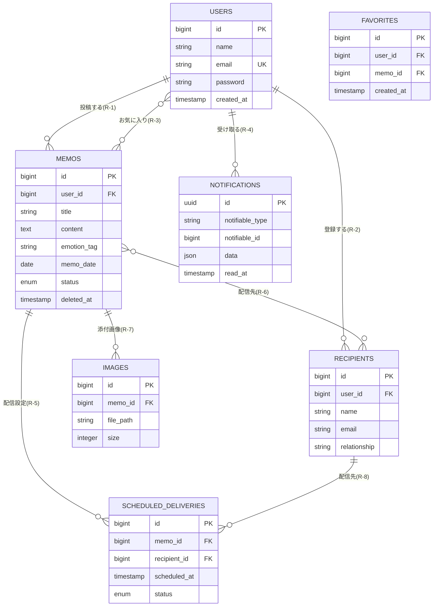

# リレーションシップ設計書

**プロジェクト**: 言伝（ことづて）アプリケーション  
**作成日**: 2024年12月16日  
**最終更新**: 2024年12月16日  
**バージョン**: 1.0

---

## 目次

1. [概要](#1-概要)
2. [リレーションシップ一覧](#2-リレーションシップ一覧)
3. [1対多リレーションシップ](#3-1対多リレーションシップ)
4. [多対多リレーションシップ](#4-多対多リレーションシップ)
5. [Polymorphicリレーションシップ](#5-polymorphicリレーションシップ)
6. [削除制約ポリシー](#6-削除制約ポリシー)
7. [実装優先度](#7-実装優先度)
8. [ER図](#8-er図)

---

## 1. 概要

本ドキュメントは、言伝アプリケーションにおける全エンティティ間のリレーションシップを定義します。

### 設計原則

- **データ整合性**: 全ての外部キー制約に`ON DELETE CASCADE`を設定
- **N+1問題対策**: Eloquent リレーションメソッドに戻り値の型ヒント必須
- **孤立レコード防止**: 親レコード削除時に関連する子レコードも自動削除
- **シンプルさ**: アプリケーション層での複雑な削除処理を回避

---

## 2. リレーションシップ一覧

### 全リレーションシップ概要

| # | 親エンティティ | カーディナリティ | 子エンティティ | リレーション種別 | 実装フェーズ | 実装状況 |
|---|---|---|---|---|---|---|
| **R-1** | Users | 1 → 多 | Memos | 1対多 | フェーズ1 | ⏳ 未実装 |
| **R-2** | Users | 1 → 多 | Recipients | 1対多 | フェーズ2 | ⏳ 未実装 |
| **R-3** | Users | 多 ↔ 多 | Memos（お気に入り） | 多対多 | フェーズ2 | ⏳ 未実装 |
| **R-4** | Users | 1 → 多 | Notifications | Polymorphic | フェーズ2 | ⏳ 未実装 |
| **R-5** | Memos | 1 → 多 | ScheduledDeliveries | 1対多 | フェーズ2 | ⏳ 未実装 |
| **R-6** | Memos | 多 ↔ 多 | Recipients | 多対多 | フェーズ2 | ⏳ 未実装 |
| **R-7** | Memos | 1 → 多 | Images | 1対多 | フェーズ2 | ⏳ 未実装 |
| **R-8** | Recipients | 1 → 多 | ScheduledDeliveries | 1対多 | フェーズ2 | ⏳ 未実装 |

---

## 3. 1対多リレーションシップ

### R-1: Users → Memos

**ビジネスルール**: 1人のユーザーは複数の言伝を投稿できる

| 項目 | 詳細 |
|---|---|
| **親テーブル** | `users` |
| **子テーブル** | `memos` |
| **外部キー** | `memos.user_id` |
| **参照先** | `users.id` |
| **削除制約** | `ON DELETE CASCADE` |
| **更新制約** | `ON UPDATE CASCADE` |
| **NULL許可** | `NOT NULL` |
| **インデックス** | `INDEX idx_user_id (user_id)` |
| **実装フェーズ** | フェーズ1 |

**Eloquentリレーション**:

```php
// app/Models/User.php
public function memos(): HasMany
{
    return $this->hasMany(Memo::class);
}

// app/Models/Memo.php
public function user(): BelongsTo
{
    return $this->belongsTo(User::class);
}
```

**マイグレーション**:

```php
Schema::create('memos', function (Blueprint $table) {
    $table->id();
    $table->foreignId('user_id')
        ->constrained('users')
        ->onDelete('cascade');
    // 他のカラム...
});
```

**削除時の動作**:
- ユーザーが削除されると、そのユーザーの全ての言伝も自動削除される

---

### R-2: Users → Recipients

**ビジネスルール**: 1人のユーザーは複数の受信者を登録できる

| 項目 | 詳細 |
|---|---|
| **親テーブル** | `users` |
| **子テーブル** | `recipients` |
| **外部キー** | `recipients.user_id` |
| **参照先** | `users.id` |
| **削除制約** | `ON DELETE CASCADE` |
| **更新制約** | `ON UPDATE CASCADE` |
| **NULL許可** | `NOT NULL` |
| **インデックス** | `INDEX idx_user_id (user_id)` |
| **実装フェーズ** | フェーズ2 |

**Eloquentリレーション**:

```php
// app/Models/User.php
public function recipients(): HasMany
{
    return $this->hasMany(Recipient::class);
}

// app/Models/Recipient.php
public function user(): BelongsTo
{
    return $this->belongsTo(User::class);
}
```

**マイグレーション**:

```php
Schema::create('recipients', function (Blueprint $table) {
    $table->id();
    $table->foreignId('user_id')
        ->constrained('users')
        ->onDelete('cascade');
    $table->string('name', 100);
    $table->string('email', 255)->nullable();
    $table->string('relationship', 50)->nullable();
    $table->timestamps();
    
    $table->index('user_id');
});
```

**削除時の動作**:
- ユーザーが削除されると、そのユーザーが登録した受信者情報も全て削除される

---

### R-5: Memos → ScheduledDeliveries

**ビジネスルール**: 1つの言伝は複数の受信者に配信スケジュールを設定できる

| 項目 | 詳細 |
|---|---|
| **親テーブル** | `memos` |
| **子テーブル** | `scheduled_deliveries` |
| **外部キー** | `scheduled_deliveries.memo_id` |
| **参照先** | `memos.id` |
| **削除制約** | `ON DELETE CASCADE` |
| **更新制約** | `ON UPDATE CASCADE` |
| **NULL許可** | `NOT NULL` |
| **インデックス** | `INDEX idx_memo_id (memo_id)` |
| **実装フェーズ** | フェーズ2 |

**Eloquentリレーション**:

```php
// app/Models/Memo.php
public function scheduledDeliveries(): HasMany
{
    return $this->hasMany(ScheduledDelivery::class);
}

// app/Models/ScheduledDelivery.php
public function memo(): BelongsTo
{
    return $this->belongsTo(Memo::class);
}
```

**マイグレーション**:

```php
Schema::create('scheduled_deliveries', function (Blueprint $table) {
    $table->id();
    $table->foreignId('memo_id')
        ->constrained('memos')
        ->onDelete('cascade');
    $table->foreignId('recipient_id')
        ->nullable()
        ->constrained('recipients')
        ->onDelete('cascade');
    $table->timestamp('scheduled_at');
    $table->timestamp('delivered_at')->nullable();
    $table->enum('status', ['pending', 'delivered', 'cancelled'])
        ->default('pending');
    $table->timestamps();
    
    $table->index('memo_id');
    $table->index('recipient_id');
    $table->index('scheduled_at');
    $table->index('status');
    $table->unique(['memo_id', 'recipient_id']);
});
```

**削除時の動作**:
- 言伝が削除されると、その配信スケジュールも全て削除される

---

### R-7: Memos → Images

**ビジネスルール**: 1つの言伝には複数の画像を添付できる

| 項目 | 詳細 |
|---|---|
| **親テーブル** | `memos` |
| **子テーブル** | `images` |
| **外部キー** | `images.memo_id` |
| **参照先** | `memos.id` |
| **削除制約** | `ON DELETE CASCADE` |
| **更新制約** | `ON UPDATE CASCADE` |
| **NULL許可** | `NOT NULL` |
| **インデックス** | `INDEX idx_memo_id (memo_id)` |
| **実装フェーズ** | フェーズ2 |

**Eloquentリレーション**:

```php
// app/Models/Memo.php
public function images(): HasMany
{
    return $this->hasMany(Image::class);
}

// app/Models/Image.php
public function memo(): BelongsTo
{
    return $this->belongsTo(Memo::class);
}
```

**マイグレーション**:

```php
Schema::create('images', function (Blueprint $table) {
    $table->id();
    $table->foreignId('memo_id')
        ->constrained('memos')
        ->onDelete('cascade');
    $table->string('file_path', 255);
    $table->string('file_name', 255);
    $table->string('mime_type', 100);
    $table->unsignedInteger('size');
    $table->timestamps();
    
    $table->index('memo_id');
});
```

**モデルイベント**（物理ファイル削除）:

```php
// app/Models/Image.php
protected static function booted(): void
{
    static::deleting(function (Image $image) {
        Storage::disk('public')->delete($image->file_path);
    });
}
```

**削除時の動作**:
- 言伝が削除されると、添付画像レコードも削除される
- モデルイベントでストレージからの物理ファイルも削除される

---

### R-8: Recipients → ScheduledDeliveries

**ビジネスルール**: 1人の受信者は複数の配信スケジュールを持つ

| 項目 | 詳細 |
|---|---|
| **親テーブル** | `recipients` |
| **子テーブル** | `scheduled_deliveries` |
| **外部キー** | `scheduled_deliveries.recipient_id` |
| **参照先** | `recipients.id` |
| **削除制約** | `ON DELETE CASCADE` |
| **更新制約** | `ON UPDATE CASCADE` |
| **NULL許可** | `NULL` (受信者未指定の場合あり) |
| **インデックス** | `INDEX idx_recipient_id (recipient_id)` |
| **実装フェーズ** | フェーズ2 |

**Eloquentリレーション**:

```php
// app/Models/Recipient.php
public function scheduledDeliveries(): HasMany
{
    return $this->hasMany(ScheduledDelivery::class);
}

// app/Models/ScheduledDelivery.php
public function recipient(): BelongsTo
{
    return $this->belongsTo(Recipient::class);
}
```

**削除時の動作**:
- 受信者が削除されると、その受信者への配信スケジュールも全て削除される

---

## 4. 多対多リレーションシップ

### R-3: Users ↔ Memos（お気に入り）

**ビジネスルール**: ユーザーは複数の言伝をお気に入りに追加でき、言伝は複数のユーザーからお気に入りされる

| 項目 | 詳細 |
|---|---|
| **エンティティA** | `users` |
| **エンティティB** | `memos` |
| **中間テーブル** | `favorites` |
| **外部キーA** | `favorites.user_id` |
| **外部キーB** | `favorites.memo_id` |
| **参照先A** | `users.id` |
| **参照先B** | `memos.id` |
| **削除制約A** | `ON DELETE CASCADE` |
| **削除制約B** | `ON DELETE CASCADE` |
| **複合ユニーク制約** | `UNIQUE KEY (user_id, memo_id)` |
| **タイムスタンプ** | あり (`created_at`, `updated_at`) |
| **実装フェーズ** | フェーズ2 |

**中間テーブル構造**:

| カラム名 | データ型 | NULL | 制約 | 説明 |
|---|---|---|---|---|
| `id` | BIGINT UNSIGNED | NO | PK, AUTO_INCREMENT | 主キー |
| `user_id` | BIGINT UNSIGNED | NO | FK → users.id | ユーザーID |
| `memo_id` | BIGINT UNSIGNED | NO | FK → memos.id | 言伝ID |
| `created_at` | TIMESTAMP | YES | - | お気に入り追加日時 |
| `updated_at` | TIMESTAMP | YES | - | 更新日時 |

**インデックス**:
- PRIMARY KEY: `id`
- INDEX: `user_id`
- INDEX: `memo_id`
- UNIQUE: `(user_id, memo_id)` ← 同じ組み合わせの重複防止

**Eloquentリレーション**:

```php
// app/Models/User.php
public function favoriteMemos(): BelongsToMany
{
    return $this->belongsToMany(Memo::class, 'favorites')
        ->withTimestamps();
}

// app/Models/Memo.php
public function favoritedByUsers(): BelongsToMany
{
    return $this->belongsToMany(User::class, 'favorites')
        ->withTimestamps();
}
```

**マイグレーション**:

```php
Schema::create('favorites', function (Blueprint $table) {
    $table->id();
    $table->foreignId('user_id')
        ->constrained('users')
        ->onDelete('cascade');
    $table->foreignId('memo_id')
        ->constrained('memos')
        ->onDelete('cascade');
    $table->timestamps();
    
    $table->index('user_id');
    $table->index('memo_id');
    $table->unique(['user_id', 'memo_id']);
});
```

**削除時の動作**:
- ユーザーが削除されると、そのユーザーのお気に入りレコードも全て削除される
- 言伝が削除されると、その言伝のお気に入りレコードも全て削除される

---

### R-6: Memos ↔ Recipients（配信スケジュール）

**ビジネスルール**: 言伝は複数の受信者に配信でき、受信者は複数の言伝を受信できる

| 項目 | 詳細 |
|---|---|
| **エンティティA** | `memos` |
| **エンティティB** | `recipients` |
| **中間テーブル** | `scheduled_deliveries` |
| **外部キーA** | `scheduled_deliveries.memo_id` |
| **外部キーB** | `scheduled_deliveries.recipient_id` |
| **参照先A** | `memos.id` |
| **参照先B** | `recipients.id` |
| **削除制約A** | `ON DELETE CASCADE` |
| **削除制約B** | `ON DELETE CASCADE` |
| **複合ユニーク制約** | `UNIQUE KEY (memo_id, recipient_id)` |
| **追加カラム** | `scheduled_at`, `delivered_at`, `status` |
| **実装フェーズ** | フェーズ2 |

**中間テーブル構造**:

| カラム名 | データ型 | NULL | 制約 | 説明 |
|---|---|---|---|---|
| `id` | BIGINT UNSIGNED | NO | PK, AUTO_INCREMENT | 主キー |
| `memo_id` | BIGINT UNSIGNED | NO | FK → memos.id | 言伝ID |
| `recipient_id` | BIGINT UNSIGNED | YES | FK → recipients.id | 受信者ID |
| `scheduled_at` | TIMESTAMP | NO | - | 配信予定日時 |
| `delivered_at` | TIMESTAMP | YES | - | 実際の配信日時 |
| `status` | ENUM | NO | DEFAULT 'pending' | 配信ステータス |
| `created_at` | TIMESTAMP | YES | - | 作成日時 |
| `updated_at` | TIMESTAMP | YES | - | 更新日時 |

**インデックス**:
- PRIMARY KEY: `id`
- INDEX: `memo_id`
- INDEX: `recipient_id`
- INDEX: `scheduled_at`
- INDEX: `status`
- UNIQUE: `(memo_id, recipient_id)` ← 同じ組み合わせの重複防止

**Eloquentリレーション**:

```php
// app/Models/Memo.php
public function recipients(): BelongsToMany
{
    return $this->belongsToMany(Recipient::class, 'scheduled_deliveries')
        ->withPivot(['scheduled_at', 'delivered_at', 'status'])
        ->withTimestamps();
}

// app/Models/Recipient.php
public function memos(): BelongsToMany
{
    return $this->belongsToMany(Memo::class, 'scheduled_deliveries')
        ->withPivot(['scheduled_at', 'delivered_at', 'status'])
        ->withTimestamps();
}
```

**特徴**:
- 中間テーブルが独立エンティティ（`ScheduledDelivery`モデル）としても機能
- Pivot情報（配信日時、ステータス）が豊富

**削除時の動作**:
- 言伝が削除されると、その配信スケジュールも全て削除される
- 受信者が削除されると、その受信者への配信スケジュールも全て削除される

---

## 5. Polymorphicリレーションシップ

### R-4: Users → Notifications

**ビジネスルール**: ユーザーは複数の通知を受け取る（Laravel標準のNotificationシステム）

| 項目 | 詳細 |
|---|---|
| **親エンティティ** | `users` |
| **子テーブル** | `notifications` |
| **Polymorphic型カラム** | `notifiable_type` |
| **Polymorphic IDカラム** | `notifiable_id` |
| **削除制約** | 手動実装（モデルイベント） |
| **インデックス** | `INDEX (notifiable_type, notifiable_id)` |
| **実装フェーズ** | フェーズ2 |

**テーブル構造**:

| カラム名 | データ型 | NULL | 制約 | 説明 |
|---|---|---|---|---|
| `id` | CHAR(36) | NO | PK (UUID) | 主キー |
| `type` | VARCHAR(255) | NO | - | 通知タイプ（クラス名） |
| `notifiable_type` | VARCHAR(255) | NO | - | 通知先のモデルタイプ |
| `notifiable_id` | BIGINT UNSIGNED | NO | - | 通知先のモデルID |
| `data` | TEXT | NO | - | 通知内容（JSON） |
| `read_at` | TIMESTAMP | YES | - | 既読日時 |
| `created_at` | TIMESTAMP | YES | - | 作成日時 |
| `updated_at` | TIMESTAMP | YES | - | 更新日時 |

**Eloquentリレーション**:

```php
// app/Models/User.php
public function notifications(): MorphMany
{
    return $this->morphMany(Notification::class, 'notifiable')
        ->orderBy('created_at', 'desc');
}
```

**マイグレーション**:

```php
Schema::create('notifications', function (Blueprint $table) {
    $table->uuid('id')->primary();
    $table->string('type');
    $table->morphs('notifiable');
    $table->text('data');
    $table->timestamp('read_at')->nullable();
    $table->timestamps();
    
    $table->index(['notifiable_type', 'notifiable_id']);
});
```

**削除時の動作**:
- Laravel標準では外部キー制約なし
- ユーザー削除時にNotificationも削除するにはモデルイベントで対応:

```php
// app/Models/User.php
protected static function booted(): void
{
    static::deleting(function (User $user) {
        $user->notifications()->delete();
    });
}
```

---

## 6. 削除制約ポリシー

### 全削除制約の一覧

| 外部キー | 親テーブル | 子テーブル | 削除制約 | 理由 |
|---|---|---|---|---|
| `memos.user_id` | `users` | `memos` | `CASCADE` | ユーザー削除時、投稿も全て削除 |
| `recipients.user_id` | `users` | `recipients` | `CASCADE` | ユーザー削除時、受信者情報も削除 |
| `favorites.user_id` | `users` | `favorites` | `CASCADE` | ユーザー削除時、お気に入りも削除 |
| `favorites.memo_id` | `memos` | `favorites` | `CASCADE` | 言伝削除時、お気に入りも削除 |
| `scheduled_deliveries.memo_id` | `memos` | `scheduled_deliveries` | `CASCADE` | 言伝削除時、配信スケジュールも削除 |
| `scheduled_deliveries.recipient_id` | `recipients` | `scheduled_deliveries` | `CASCADE` | 受信者削除時、配信スケジュールも削除 |
| `images.memo_id` | `memos` | `images` | `CASCADE` | 言伝削除時、添付画像も削除 |

### CASCADE採用の理由

1. **データ整合性の維持**: 孤立レコードを防止
2. **シンプルな削除処理**: アプリケーション層での複雑な制御が不要
3. **パフォーマンス**: データベース層で一括削除される
4. **安全性**: 関連データの削除漏れを防止

### 物理ファイル削除の対応

データベースレコードは`CASCADE`で自動削除されるが、ストレージ上の物理ファイルはモデルイベントで削除:

```php
// app/Models/Image.php
protected static function booted(): void
{
    static::deleting(function (Image $image) {
        Storage::disk('public')->delete($image->file_path);
    });
}

// app/Models/User.php (プロフィール画像)
protected static function booted(): void
{
    static::deleting(function (User $user) {
        if ($user->profile_photo_path) {
            Storage::disk('public')->delete($user->profile_photo_path);
        }
    });
}
```

---

## 7. 実装優先度

### 🎯 フェーズ1: コアMVP（最優先）

**実装対象リレーションシップ**:

| # | リレーション | 種類 | 優先度 |
|---|---|---|---|
| **R-1** | Users → Memos | 1対多 | 🔴 最優先 |

**実装順序**:

1. `EmotionTag` Enumクラス作成
2. `create_memos_table` マイグレーション
3. `Memo`モデル作成（リレーション設定）
4. `MemoFactory` + `MemoSeeder` 作成
5. `MemoPolicy` 作成

---

### 🚀 フェーズ2: 機能強化

**実装対象リレーションシップ**:

| # | リレーション | 種類 | 優先度 |
|---|---|---|---|
| **R-2** | Users → Recipients | 1対多 | 🟡 高 |
| **R-5** | Memos → ScheduledDeliveries | 1対多 | 🟡 高 |
| **R-6** | Memos ↔ Recipients | 多対多 | 🟡 高 |
| **R-8** | Recipients → ScheduledDeliveries | 1対多 | 🟡 高 |
| **R-7** | Memos → Images | 1対多 | 🟢 中 |
| **R-3** | Users ↔ Memos（お気に入り） | 多対多 | 🟢 中 |
| **R-4** | Users → Notifications | Polymorphic | 🔵 低 |

**実装順序**:

1. `Recipients`テーブル + モデル
2. `ScheduledDeliveries`テーブル + モデル
3. `Images`テーブル + モデル
4. `Favorites`中間テーブル
5. `Notifications`テーブル（Laravel標準コマンド使用）

---

## 8. ER図

### テキスト形式

```
┌─────────────────────┐
│       Users         │
│    (実装済み)        │
├─────────────────────┤
│ id (PK)             │
│ name                │
│ email (UNIQUE)      │
│ password            │
└──────┬──────────────┘
       │
       │ 1:多 (R-1)
       │
       ▼
┌─────────────────────┐         ┌──────────────────┐
│       Memos         │  多:1   │   EmotionTag     │
│    (フェーズ1)       │────────▶│   (Enumクラス)    │
├─────────────────────┤  (R-2)  ├──────────────────┤
│ id (PK)             │         │ JOY              │
│ user_id (FK)        │         │ SADNESS          │
│ title               │         │ GRATITUDE        │
│ content             │         │ PRIDE            │
│ emotion_tag         │         │ REGRET           │
│ memo_date           │         │ LOVE             │
│ sender              │         │ HABIT            │
│ recipient           │         │ NOSTALGIA        │
│ status              │         └──────────────────┘
│ published_at        │
│ deleted_at (SOFT)   │
└─────────────────────┘
```

### フェーズ2以降の拡張

```
                    ┌─────────────────┐
                    │     Users       │
                    └────────┬────────┘
                             │
          ┌──────────────────┼──────────────────┐
          │                  │                  │
          │ 1:多 (R-2)       │ 1:多 (R-4)       │ 多:多 (R-3)
          │                  │                  │ (favorites)
          ▼                  ▼                  ▼
    ┌──────────┐      ┌──────────────┐    ┌─────────┐
    │Recipients│      │Notifications │    │  Memos  │
    └────┬─────┘      └──────────────┘    └────┬────┘
         │                                      │
         │ 1:多 (R-8)                           │ 1:多 (R-7)
         │                                      │
         │         ┌────────────────┐           ▼
         │         │ScheduledDel... │      ┌────────┐
         └────────▶│  (中間テーブル)  │      │ Images │
    多:多 (R-6)    └────────────────┘      └────────┘
                          ▲
                          │ 1:多 (R-5)
                          │
                    ┌─────┴─────┐
                    │   Memos   │
                    └───────────┘
```

### Mermaid形式



---

## 9. N+1問題対策

### Eager Loading の実装例

```php
// NG: N+1問題が発生
$memos = Memo::all();
foreach ($memos as $memo) {
    echo $memo->user->name; // 毎回クエリが実行される
    echo $memo->images->count(); // 毎回クエリが実行される
}

// OK: Eager Loading
$memos = Memo::with(['user', 'images'])->get();
foreach ($memos as $memo) {
    echo $memo->user->name; // 先読み済み
    echo $memo->images->count(); // 先読み済み
}

// 推奨: ネストしたリレーションも先読み込み
$memos = Memo::with([
    'user',
    'images',
    'scheduledDeliveries.recipient'
])->get();
```

### デフォルト先読み込み（モデル設定）

```php
// app/Models/Memo.php
protected $with = ['user']; // 常にuserを先読み込み
```

---

## 10. 実装チェックリスト

### フェーズ1

- [ ] EmotionTag Enumクラス作成
- [ ] Memosテーブルマイグレーション
- [ ] Memoモデル（リレーション設定）
- [ ] MemoFactory
- [ ] MemoSeeder
- [ ] MemoPolicy
- [ ] N+1対策（Eager Loading）のテスト

### フェーズ2

- [ ] Recipientsテーブルマイグレーション
- [ ] Recipientモデル（リレーション設定）
- [ ] ScheduledDeliveriesテーブルマイグレーション
- [ ] ScheduledDeliveryモデル（リレーション設定）
- [ ] Imagesテーブルマイグレーション
- [ ] Imageモデル（リレーション + 削除イベント）
- [ ] Favorites中間テーブルマイグレーション
- [ ] Notificationsテーブル作成（`sail artisan notifications:table`）
- [ ] 各Policyクラス作成
- [ ] 各Factoryクラス作成

---

## 📝 変更履歴

| 日付 | バージョン | 変更内容 | 担当者 |
|------|-----------|---------|--------|
| 2024-12-16 | 1.0 | 初版作成 | AI Assistant |

---

## 📌 関連ドキュメント

- [entities.md](./entities.md) - エンティティ定義
- [requirements.md](./requirements.md) - プロジェクト要件定義

---

**文書管理情報**:
- ファイル名: relationships.md
- 保存場所: プロジェクトルート
- 最終更新者: AI Assistant
- 次回レビュー: フェーズ1実装完了後

